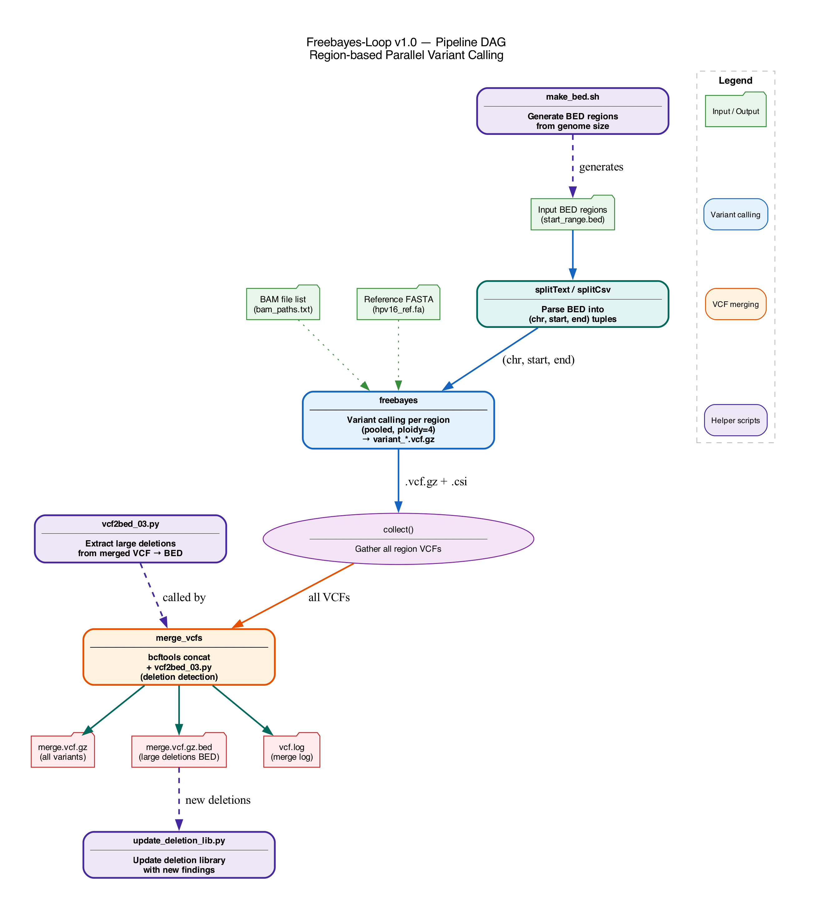

# Freebayes-Loop

A Nextflow DSL2 pipeline for region-based parallel variant calling with [freebayes](https://github.com/freebayes/freebayes), designed for pooled HPV sequencing samples. The pipeline splits genomic regions from a BED file, runs freebayes in parallel per region, merges the resulting VCFs, and detects large deletions.

## Overview

This pipeline addresses the computational challenge of variant calling across many pooled samples by parallelizing freebayes across genomic regions. It is particularly suited for HPV genome variant calling where pooled-sample analysis with high sensitivity is required.

### Pipeline DAG



### Pipeline Workflow

```
Input BED regions (start_range.bed)
    │
    ▼
splitText / splitCsv ── Parse BED into (chr, start, end) tuples
    │
    ▼
freebayes ──────────── Variant calling per region (pooled, ploidy=4)
    │                    → variant_*.vcf.gz + .csi index
    │
    ▼
collect() ──────────── Gather all per-region VCFs
    │
    ▼
merge_vcfs ─────────── bcftools concat + vcf2bed_03.py
    │                    → merge.vcf.gz (all variants)
    │                    → merge.vcf.gz.bed (large deletions)
    │                    → vcf.log (merge log)
    ▼
Output files
```

### Processes

| Process | Description |
|---------|-------------|
| `freebayes` | Region-based variant calling with freebayes using pooled-sample settings (ploidy=4, pooled-discrete, pooled-continuous) |
| `merge_vcfs` | Merges per-region VCFs with `bcftools concat` and detects large deletions using `vcf2bed_03.py` |

### Key Features

- **Parallel execution**: Each BED region runs as an independent freebayes job
- **Pooled sample support**: Configured for multi-sample pooled analysis (ploidy=4, pooled-discrete/continuous)
- **Large deletion detection**: Automatically extracts deletions exceeding a configurable minimum length
- **Chunk splitting**: Large deletions are split into manageable chunks for downstream re-analysis
- **Flexible execution**: Supports local, SLURM, SGE, Docker, and Singularity via profiles

## Requirements

### Software

- [Nextflow](https://www.nextflow.io/) (version 22.10+, DSL2)
- [freebayes](https://github.com/freebayes/freebayes) (variant caller)
- [bcftools](http://www.htslib.org/) (VCF manipulation)
- [htslib](http://www.htslib.org/) (bgzip for VCF compression)
- Python 3

### Input Data

- **BAM files**: Aligned to a reference containing HPV sequences, listed in a text file (one path per line)
- **Reference FASTA**: The reference genome used for alignment (must be indexed with `samtools faidx`)
- **BED file**: Genomic regions for parallel variant calling (space-delimited: `chr start end`)

## Installation

```bash
git clone https://github.com/asangphukieo/freebayes-loop.git
cd freebayes-loop
```

## Usage

### Basic Run

```bash
nextflow run freebayes_loop.nf \
    --bam_path /path/to/bam_paths.txt \
    --ref /path/to/reference.fa \
    --input_file start_range.bed
```

### Full Run with All Options

```bash
nextflow run freebayes_loop.nf \
    --bam_path /path/to/bam_paths.txt \
    --ref /path/to/reference.fa \
    --input_file start_range.bed \
    --publish_dir ./results \
    --min_del 10 \
    --cpu 4 \
    --mem 40 \
    -profile slurm \
    -resume
```

### Parameters

| Parameter | Required | Default | Description |
|-----------|----------|---------|-------------|
| `--bam_path` | **Yes** | - | Text file listing BAM file paths (one per line) |
| `--ref` | **Yes** | - | Reference FASTA file (must be indexed) |
| `--input_file` | No | `start_range.bed` | BED file with genomic regions for parallelization |
| `--publish_dir` | No | `./results` | Output directory |
| `--min_del` | No | `10` | Minimum deletion length (bp) to report |
| `--cpu` | No | `4` | Number of CPUs per process |
| `--mem` | No | `40` | Memory in GB per process |
| `--help` | No | - | Show help message |

### Execution Profiles

| Profile | Description |
|---------|-------------|
| `standard` | Local execution (default) |
| `slurm` | SLURM cluster execution |
| `sge` | SGE cluster execution |
| `docker` | Run with Docker containers |
| `singularity` | Run with Singularity containers |
| `test` | Test profile with mock data |

### Input File Formats

**BAM paths file** (`bam_paths.txt`):
```
/path/to/sample1.bam
/path/to/sample2.bam
/path/to/sample3.bam
```

**BED regions file** (`start_range.bed`, space-delimited):
```
gi|333031|lcl|HPV16REF.1| 1 250
gi|333031|lcl|HPV16REF.1| 251 500
```

You can generate BED regions using the helper script:
```bash
bash scripts/make_bed.sh 1 7906 250 "gi|333031|lcl|HPV16REF.1|"
```
This splits the genome (positions 1-7906) into 250 bp chunks.

### Output

```
results/
├── variant_1-250.vcf.gz         # Per-region VCF (one per BED region)
├── variant_1-250.vcf.gz.csi     # Per-region VCF index
├── variant_251-500.vcf.gz
├── variant_251-500.vcf.gz.csi
├── merge.vcf.gz                 # Merged VCF (all regions concatenated)
├── merge.vcf.gz.bed             # Large deletions in BED format
└── vcf.log                      # Merge operation log
```

### Freebayes Parameters

The pipeline uses the following freebayes settings optimized for pooled HPV samples:

| Setting | Value | Description |
|---------|-------|-------------|
| `--ploidy` | 4 | Ploidy for pooled sample analysis |
| `--pvar` | 0 | Report all sites (with `--report-monomorphic`) |
| `--min-alternate-fraction` | 0.03 | Low threshold for sensitive detection |
| `--min-alternate-count` | 1 | Report variants with at least 1 supporting read |
| `-m` | 55 | Minimum mapping quality |
| `-q` | 13 | Minimum base quality |
| `--read-indel-limit` | 2 | Maximum indels per read |
| `--use-best-n-alleles` | 4 | Consider top 4 alleles |
| `--min-coverage` | 200 | Minimum coverage to call variants |
| `--pooled-discrete` | - | Pooled sample model (discrete) |
| `--pooled-continuous` | - | Pooled sample model (continuous) |
| `--haplotype-length` | 0 | Disable haplotype calling |
| `--report-monomorphic` | - | Report monomorphic sites |

## Helper Scripts

| Script | Description | Usage |
|--------|-------------|-------|
| `scripts/vcf2bed_03.py` | Extracts large deletions from VCF, outputs BED format. Splits large deletions into chunks. | `python vcf2bed_03.py <min_del> <vcf.gz> <bp_per_chunk>` |
| `scripts/update_deletion_lib.py` | Updates a deletion library with newly detected deletions, avoiding duplicates. | `python update_deletion_lib.py <new.bed> <library.bed>` |
| `scripts/make_bed.sh` | Generates BED regions by splitting a genome into chunks of specified size. | `bash make_bed.sh <start> <max> <chunk_size> <chr_name>` |

### Example: Generating BED Regions

```bash
# Split HPV16 genome (7906 bp) into 250 bp chunks
bash scripts/make_bed.sh 1 7906 250 "gi|333031|lcl|HPV16REF.1|" > start_range.bed
```

### Example: Extracting Deletions

```bash
# Find deletions > 10 bp, split into 30 bp chunks
python scripts/vcf2bed_03.py 10 merge.vcf.gz 30
```

### Example: Updating Deletion Library

```bash
# Add new deletions to the library
python scripts/update_deletion_lib.py merge.vcf.gz.bed deletion_library.bed
```

## Test Data

Mock test data is provided under `test_data/`:

```
test_data/
├── hpv16_ref.fa                  # Mock HPV16 reference (500 bp)
├── hpv16_ref.fa.fai              # Reference index
├── sample1.bam                   # Mock BAM (100 read pairs)
├── sample1.bam.bai
├── sample2.bam                   # Mock BAM (100 read pairs)
├── sample2.bam.bai
├── bam_paths.txt                 # BAM file list
├── start_range.bed               # Two regions (1-250, 251-500)
└── example_output/
    └── merge.vcf.gz.bed          # Example deletion BED output
```

To run with test data (requires freebayes, bcftools, bgzip installed):

```bash
nextflow run freebayes_loop.nf \
    --bam_path test_data/bam_paths.txt \
    --ref test_data/hpv16_ref.fa \
    --input_file test_data/start_range.bed \
    --publish_dir ./test_output \
    --cpu 1 \
    --mem 2
```

Or using the test profile:

```bash
nextflow run freebayes_loop.nf -profile test
```

Test data was generated using `generate_test_data.py` (requires Python 3 + pysam).

## Citation

If you use this pipeline, please cite:

- freebayes: Garrison, E. & Marth, G. *Haplotype-based variant detection from short-read sequencing.* arXiv:1207.3907 (2012).
- bcftools: Danecek, P., et al. *Twelve years of SAMtools and BCFtools.* GigaScience 10, giab008 (2021).

## License

This project is licensed under the GNU General Public License v3.0 - see the [LICENSE](LICENSE) file for details.

Copyright (C) IARC/WHO
